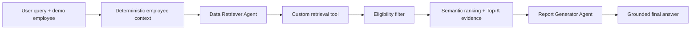

# BenefitWise AI

BenefitWise AI is a planned personalized employee benefits assistant for the
BBL Innovation Data and AI Fest 2026 AI Engineer programming test. The target
system uses two sequential LangGraph agents: one retrieves eligible policy
evidence from a local knowledge base, and the other turns only that evidence
into a clear answer.

> **Current status:** the deterministic core RAG layer is implemented and
> evaluated. The two agents, LangGraph orchestration, grounded answer generation,
> and UI belong to the next branches and are not implemented yet.

## Planned workflow



The employee identity and eligibility rules are deterministic. The language
model may formulate what to search for, but it may not choose or alter the
employee profile used for filtering.

## Implemented core RAG

- Immutable employee context with employee ID, job level, country, company,
  and employee type.
- Idempotent SQLite initialization for E001/JL3, E002/JL6, and E003/JL9.
- Normalized deterministic lookup with explicit unknown-employee and
  uninitialized-database errors.
- Reviewer-readable `knowledge_base.txt` with 12 policies and explicit
  eligibility metadata.
- Strict policy parsing and employee metadata filtering before semantic work.
- Local sentence embeddings, cosine similarity, relevance threshold, and Top-K.
- Employee-bound LangChain retrieval tool that exposes no employee ID argument
  to the model.
- Deterministic unit/retrieval tests plus a real embedding evaluation.

After completing the environment setup in the development guide, create the
ignored local demo database with:

```powershell
python scripts/seed_employees.py
```

Run the committed 13-case retrieval evaluation (the model downloads on first
use):

```powershell
python scripts/evaluate_retrieval.py
```

Current results with `all-MiniLM-L6-v2`, Top-3, and a `0.25` threshold are
Hit@1 `1.000`, Hit@3 `1.000`, MRR `1.000`, and no-evidence accuracy `1.000`.
See [the evaluation report](eval/RESULTS.md) for scope and limitations.

## Project guidance

- [Architecture](docs/ARCHITECTURE.md)
- [Local development](docs/DEVELOPMENT.md)
- [Testing strategy](docs/TESTING.md)
- [Technical decisions](docs/DECISIONS.md)
- [Active plan and roadmap](PLANS.md)
- [Coding-agent instructions](AGENTS.md)

Setup commands and the current verification state are documented in
[docs/DEVELOPMENT.md](docs/DEVELOPMENT.md). Agent output examples, LangGraph
traces, UI screenshots, and final run instructions will be added only after
those features exist and have been verified.
