# BenefitWise AI

BenefitWise AI is a reviewer-ready, end-to-end policy chatbot that retrieves
sanitized benefit-policy evidence and produces a grounded answer for a selected
fictional employee profile.

> **Demo scope:** employee profiles are fictional and the policy source is a
> sanitized demonstration dataset, not an official policy or employee system.

Built with **LangGraph**, a **LangChain custom tool**, OpenAI
`text-embedding-3-small`, local **Chroma**, and **SQLite**.

## Assignment Requirements -> Implementation

| Assignment requirement                          | Implemented evidence                                                                                                          |
| ----------------------------------------------- | ----------------------------------------------------------------------------------------------------------------------------- |
| Two distinct agents                             | A Data Retriever Agent is forced to retrieve evidence; a separate, tool-free Report Generator synthesizes it.                 |
| Custom retrieval tool over `knowledge_base.txt` | `retrieve_benefit_policies` reads policy chunks derived from the committed text source and returns raw `PolicyEvidence`.      |
| Sequential orchestration                        | One compiled LangGraph executes employee resolution -> Retriever -> retrieval tool -> Generator.                              |
| Grounded, non-redundant final answer            | The Generator receives evidence only; deterministic citation and numeric validation fail closed when support is missing.      |
| Runnable code and screenshots                   | The repository includes the Python runtime, source data, tests/evaluations, local-demo UI, and captured workflow screenshots. |

## End-to-End Experience

1. Select one of the clearly labelled fictional employee profiles.
2. Ask a benefit-policy question in English or Thai.
3. The Data Retriever Agent calls the custom retrieval tool, which filters
   policy candidates deterministically and returns the most relevant evidence.
4. The Report Generator produces a concise answer with reader-friendly policy
   source labels and a deterministic note about the selected profile's
   applicability.

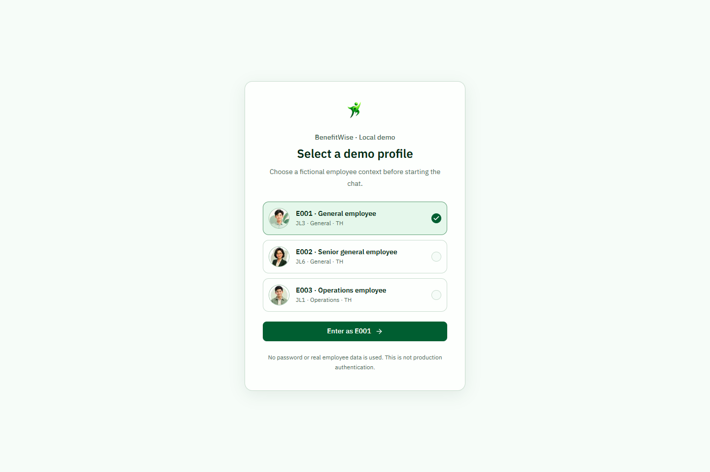

### Current chat examples

The following captured answers use fictional E001 context and the current
reader-facing source labels; policy IDs remain inside the observable tool result
and evaluation state, not in the employee-facing answer.

**Personalized OPD answer**

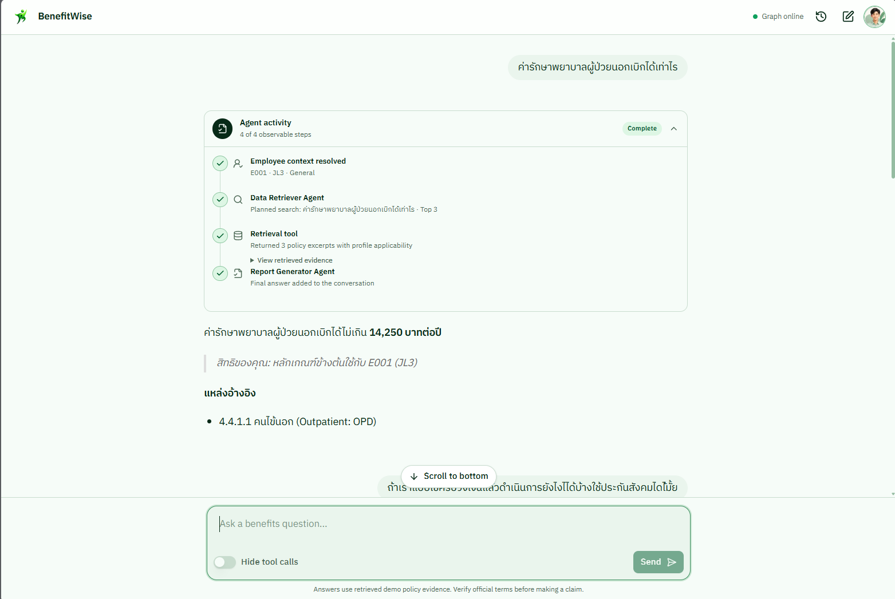

**Policy-first answer for an explicitly named Operations JL1 audience**

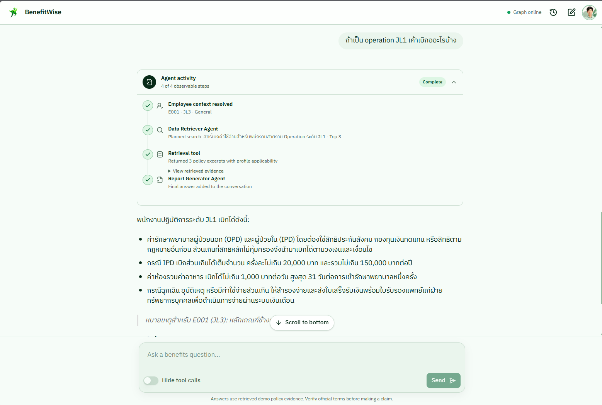

**Cautious, evidence-bounded answer for a social-security follow-up**

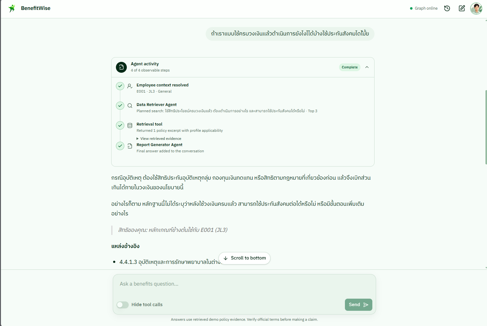

### Responsive mobile view

The same current UI supports fictional profile selection and grounded answers
at a mobile viewport.

| Mobile profile selection                                                         | Mobile grounded OPD answer                                                      |
| -------------------------------------------------------------------------------- | ------------------------------------------------------------------------------- |
| 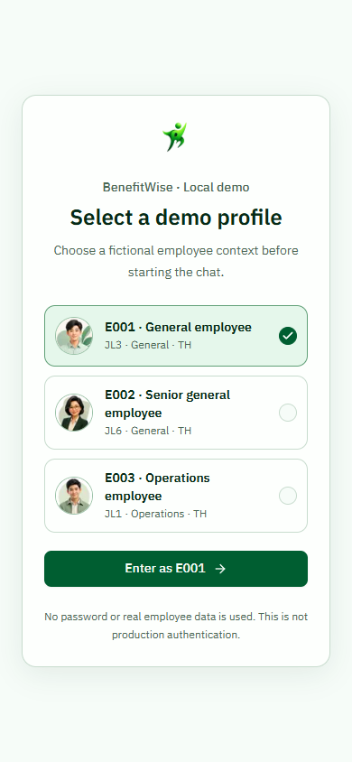 | 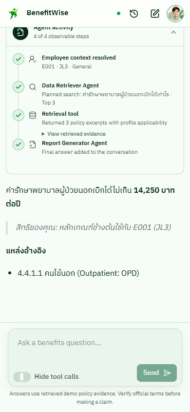 |

The expandable evidence view is also usable on mobile; it exposes tool output
and retrieved policy excerpts, not private model reasoning.

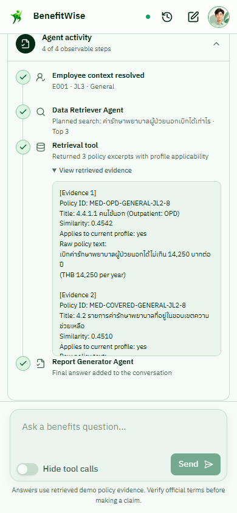

The visible **Agent activity** panel shows observable graph state and tool
events: employee context resolved, tool call, tool result, and answer complete.
It is deliberately not a display of private model chain-of-thought.

## Architecture at a Glance

The central guarantee is simple: **employee identity and personal eligibility
are resolved deterministically outside the LLM.** The model can formulate a
search query, but cannot select an employee, alter a profile, or decide
eligibility.

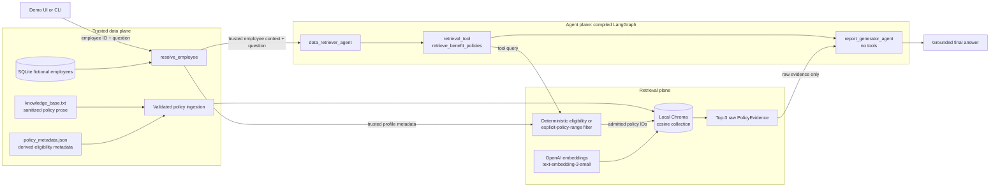

`knowledge_base.txt` and `policy_metadata.json` are authoritative. Local
Chroma is generated and rebuildable; it ranks only policy IDs already admitted
by deterministic filtering and never decides eligibility.

## How Retrieval Is Grounded

The policy file is parsed into natural numbered-policy clauses rather than
arbitrary token windows. The current clauses preserve complete rules, so the
measured chunk-overlap setting is `0` rather than duplicating adjacent evidence.

For each question, the runtime:

1. validates the policy text against the metadata sidecar;
2. selects policy IDs using trusted employee eligibility for a personal
   question, or the requested policy-level range when a question explicitly
   names a JL audience;
3. passes only those IDs into Chroma's metadata filter;
4. embeds the query using OpenAI `text-embedding-3-small` and ranks the
   allowed vectors by cosine similarity;
5. requires the original user question to clear the measured `0.26` relevance
   threshold, then returns at most Top-3 evidence objects; and
6. returns each object with its policy ID, title, raw excerpt, similarity score,
   eligibility data, and deterministic applicability flag.

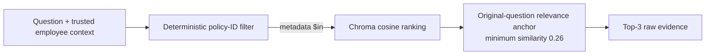

For an explicitly named policy audience such as `JL8`, that level selects the
policy source range only. It never replaces the trusted identity of the
currently selected fictional employee; the final applicability note is computed
separately.

## LangGraph Orchestration: Nodes, Edges, and State

The exact compiled topology is:

```text
START
  -> resolve_employee
  -> data_retriever_agent
  -> retrieval_tool
  -> report_generator_agent
  -> END
```

The current compiled graph is shown below in LangGraph Studio. It is the same
four-node topology the application invokes, rather than a hand-drawn diagram.


| Node                     | Receives                                        | Produces                          | Boundary                                       |
| ------------------------ | ----------------------------------------------- | --------------------------------- | ---------------------------------------------- |
| `resolve_employee`       | Employee ID and question                        | Trusted `employee_context`        | SQLite lookup; no LLM call.                    |
| `data_retriever_agent`   | Question and trusted context                    | Exactly one retrieval tool call   | Returns no end-user answer.                    |
| `retrieval_tool`         | Search query plus closure-bound trusted context | Ordered raw evidence              | Determines eligible candidates before ranking. |
| `report_generator_agent` | Question, trusted context, and evidence         | Final answer and grounding status | Has no tools.                                  |

| Reviewer-relevant graph state | Purpose                                                                |
| ----------------------------- | ---------------------------------------------------------------------- |
| `employee_id`                 | Selects the fictional profile for deterministic resolution.            |
| `user_query` / `messages`     | Carries the current CLI/evaluation question or Agent Chat interaction. |
| `employee_context`            | Immutable SQLite-derived profile used by retrieval.                    |
| `retrieval_query`             | Search wording emitted for the bounded tool call.                      |
| `evidence`                    | Ordered, raw policy evidence returned by the retrieval tool.           |
| `citation_policy_ids`         | Machine-readable policy IDs retained for evaluation and grounding.     |
| `final_answer`                | Grounded response with human-readable source labels.                   |
| `grounding_valid`             | Deterministic release check after citation and numeric validation.     |

The Retriever's tool output crosses the next edge as structured evidence. The
Generator receives no retrieval capability, no employee-selection capability,
and no tool access.

## Tool Call -> Evidence -> Final Answer

The Retriever is configured to make exactly one call to
`retrieve_benefit_policies`. Its result is evidence, not a response to the
employee. The output shows the policy ID, title, raw policy excerpt, similarity,
and deterministic applicability information passed to the next node.

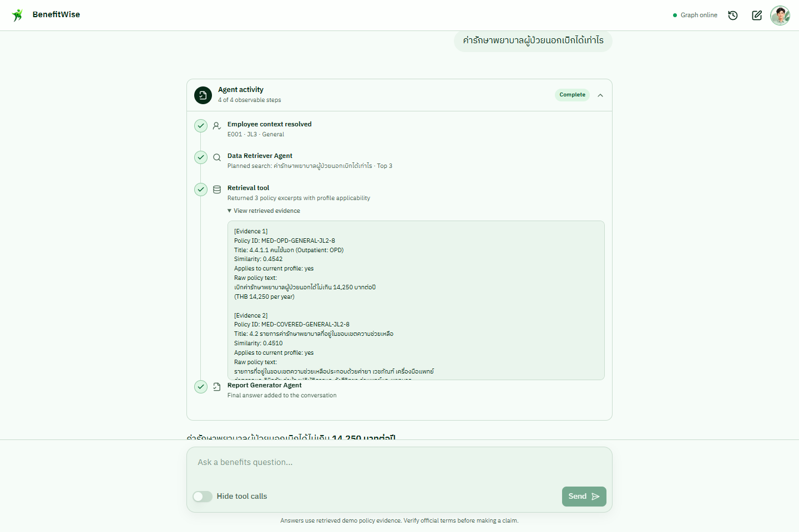

The Report Generator uses only returned policy IDs as internal validation
markers. Before release, the application verifies those citations and numerical
claims against the evidence, preserves the IDs in structured graph output, and
renders readable policy-section labels in the employee-facing answer. If there
is no relevant evidence, or validation fails, it returns an explicit grounded
insufficient-information response rather than filling a gap with general
knowledge.

## Observability: Real LangSmith Trace

LangSmith tracing is available when a reviewer configures their own
`LANGSMITH_API_KEY`. The sanitized captured graph run has this hierarchy:

```text
benefitwise_two_agent_workflow
  resolve_employee
  data_retriever_agent
    ChatOpenAI
  retrieval_tool
    retrieve_benefit_policies
  report_generator_agent
    ChatOpenAI
```

The run tree below was captured from an authenticated project, then cropped to
the hierarchy only. It excludes prompts, query text, raw policy content, keys,
account details, and identifiers beyond the fictional demo IDs.

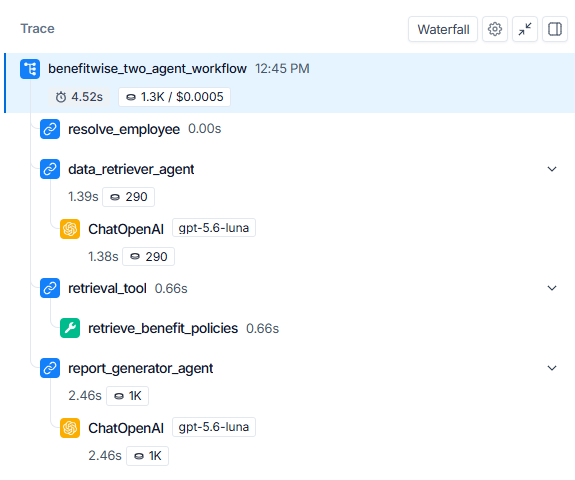

The complete trace contract and local inspection steps are in
[Observability](docs/OBSERVABILITY.md).

## Evaluation Results

Executed on 2026-08-09 with Python 3.13.5, the committed small curated datasets
produced the following results. These are implementation checks, not claims of
production-quality accuracy.

| Retrieval evaluation (16 cases: 14 positive, 2 no-evidence) | Result |
| ----------------------------------------------------------- | -----: |
| Hit@1                                                       |  1.000 |
| Hit@3                                                       |  1.000 |
| MRR                                                         |  1.000 |
| No-evidence accuracy                                        |  1.000 |

| Workflow evaluation (12 committed cases) | Result |
| ---------------------------------------- | -----: |
| Evidence accuracy                        |  1.000 |
| Citation accuracy                        |  1.000 |
| Grounding pass rate                      |  1.000 |
| Abstention accuracy                      |  1.000 |
| Overall pass rate                        |  1.000 |

The retrieval evaluation uses the real embedding API; the workflow evaluation
uses the configured `gpt-5.6-luna` model with low reasoning effort. Review the
executed [retrieval report](eval/RESULTS.md) and [workflow report](eval/AGENT_RESULTS.md)
for case scope, calibration, and known limitations.

## Run It Locally

The following Windows-first path starts the complete local demo. Detailed setup
and verification guidance remains in [Development](docs/DEVELOPMENT.md) and
[Testing](docs/TESTING.md).

```powershell
py -3.13 -m venv .venv
.\.venv\Scripts\Activate.ps1
python -m pip install --upgrade pip
python -m pip install -r requirements.txt
python -m pip install -e . --no-deps
Copy-Item .env.example .env
# Set OPENAI_API_KEY in the ignored .env file.
python scripts/seed_employees.py
```

In terminal A, start the graph API and LangGraph Studio:

```powershell
$env:PYTHONUTF8 = "1"
langgraph dev
```

In terminal B, start the reviewer UI:

```powershell
cd frontend
npm install
npm run dev
```

Open `http://localhost:3000`. To use the CLI or rerun the committed checks:

```powershell
python scripts/run_cli.py --employee-id E001 --query "What is my OPD limit?" --show-evidence
python scripts/evaluate_retrieval.py
python scripts/evaluate_agents.py
```

## Boundaries and Limitations

- The profile selector is fictional demo authentication, not production SSO.
- The policy source is sanitized demo content, not an official employee policy.
- The local Chroma index is generated/rebuildable; source text and metadata are
  the authoritative inputs.
- The project makes no production claims for authentication, authorization,
  retention, observability governance, deployment, or policy maintenance.
- Perfect scores are limited to small curated evaluation datasets and do not
  replace broader evaluation or human policy review.

## Repository Guide

| Location                                       | Contents                                                                        |
| ---------------------------------------------- | ------------------------------------------------------------------------------- |
| [`src/`](src/)                                 | Python package: employee context, policy parsing, retrieval, agents, and graph. |
| [`knowledge_base.txt`](knowledge_base.txt)     | Sanitized, human-readable policy source.                                        |
| [`policy_metadata.json`](policy_metadata.json) | Validated policy mapping, retrieval hints, and eligibility metadata.            |
| [`tests/`](tests/)                             | Deterministic unit, integration, tool, and graph coverage.                      |
| [`eval/`](eval/)                               | Committed evaluation cases and executed reports.                                |
| [`docs/`](docs/)                               | Detailed architecture, development, testing, observability, and decisions.      |

For deeper engineering contracts, see [Architecture](docs/ARCHITECTURE.md),
[Observability](docs/OBSERVABILITY.md), [Decisions](docs/DECISIONS.md),
[Development](docs/DEVELOPMENT.md), and [Testing](docs/TESTING.md).
