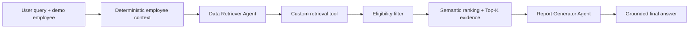

# BenefitWise AI

BenefitWise AI is a planned personalized employee benefits assistant for the
BBL Innovation Data and AI Fest 2026 AI Engineer programming test. The target
system uses two sequential LangGraph agents: one retrieves eligible policy
evidence from a local knowledge base, and the other turns only that evidence
into a clear answer.

> **Current status:** core RAG, both agents, the sequential LangGraph, grounded
> answer generation, CLI, and smoke scenarios are implemented. The demo UI and
> final observability/presentation work remain future branches.

## Implemented workflow



The employee identity and eligibility rules are deterministic. The language
model may formulate what to search for, but it may not choose or alter the
employee profile used for filtering.

## Implemented core RAG

- Immutable employee context with employee ID, job level, country, company,
  and employee type.
- Idempotent SQLite initialization for E001/JL3 General, E002/JL6 General,
  and E003/JL1 Operations demo profiles.
- Normalized deterministic lookup with explicit unknown-employee and
  uninitialized-database errors.
- Reviewer-readable `knowledge_base.txt` containing only sanitized policy prose.
  Personal names, signatures, organization branding, extraction artifacts, and
  masked text are excluded.
- Separate `policy_metadata.json` containing the section-to-policy mapping,
  bilingual retrieval terms, and deterministic eligibility rules authored for
  this demo.
- Strict source/sidecar validation and employee metadata filtering before
  semantic work. Retrieval hints improve matching but never enter evidence.
- OpenAI `text-embedding-3-small` context embeddings, cosine similarity,
  relevance threshold, and Top-K.
- Employee-bound LangChain retrieval tool that exposes no employee ID argument
  to the model.
- Deterministic unit/retrieval tests plus a real embedding evaluation.
- Data Retriever Agent forced to call the custom retrieval tool exactly once.
- Tool-free Report Generator Agent with citation and numeric-grounding checks.
- Explicit four-node LangGraph state flow and API-backed CLI demo.

After completing the environment setup in the development guide, create the
ignored local demo database with:

```powershell
python scripts/seed_employees.py
```

Run the committed 14-case retrieval evaluation (requires `OPENAI_API_KEY`):

```powershell
python scripts/evaluate_retrieval.py
```

Current results with `text-embedding-3-small`, Top-3, and a `0.26` threshold are
Hit@1 `1.000`, Hit@3 `1.000`, MRR `1.000`, and no-evidence accuracy `1.000`.
See [the evaluation report](eval/RESULTS.md) for scope and limitations.

Run one complete two-agent query:

```powershell
python scripts/run_cli.py `
  --employee-id E002 `
  --query "How much can I claim for outpatient medical expenses?" `
  --show-evidence
```

Run the committed smoke scenarios, optionally limiting API usage during
development:

```powershell
python scripts/run_smoke_queries.py --limit 1
```

Validate or inspect the graph with the LangGraph CLI:

```powershell
langgraph validate
langgraph dev
```

The verified E001/JL3 example returns the THB 14,250 annual OPD limit, while
E003/Operations JL1 returns THB 300 per visit for at most 15 visits per year.
Both answers cite their eligible policy IDs. An unsupported parking query
returns a grounded insufficient-information response without invoking the
Report Generator model.

## Project guidance

- [Architecture](docs/ARCHITECTURE.md)
- [Local development](docs/DEVELOPMENT.md)
- [Testing strategy](docs/TESTING.md)
- [Technical decisions](docs/DECISIONS.md)
- [Active plan and roadmap](PLANS.md)
- [Coding-agent instructions](AGENTS.md)

Setup commands and the current verification state are documented in
[docs/DEVELOPMENT.md](docs/DEVELOPMENT.md). LangSmith traces, UI screenshots,
and final reviewer presentation material will be added only after those
features exist and have been verified.
