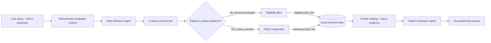
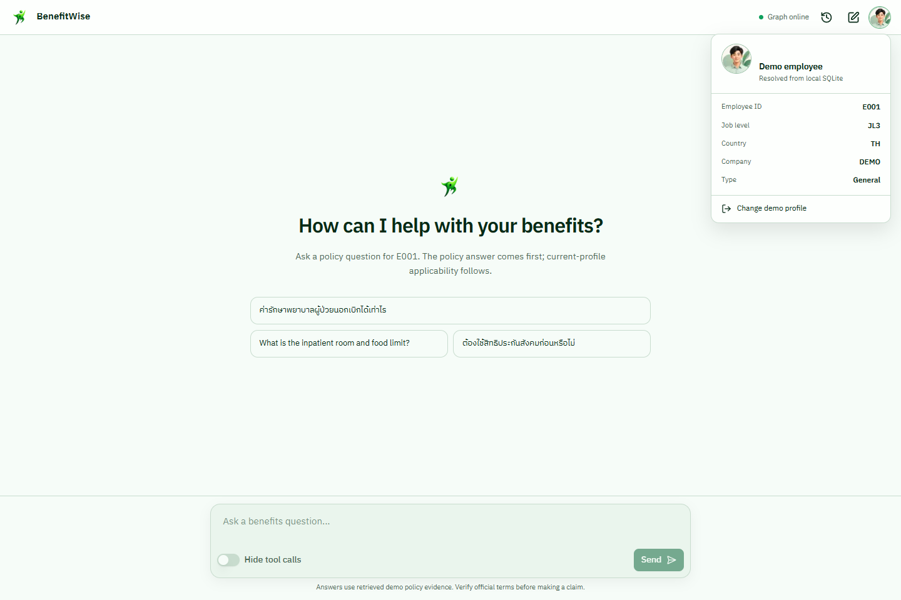
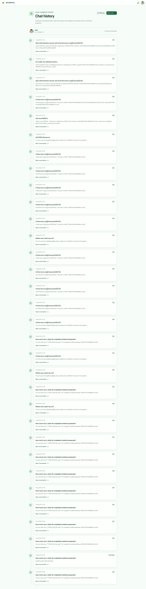
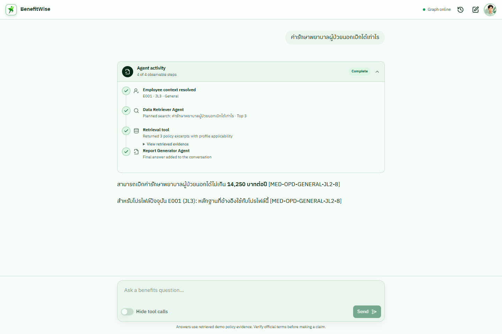
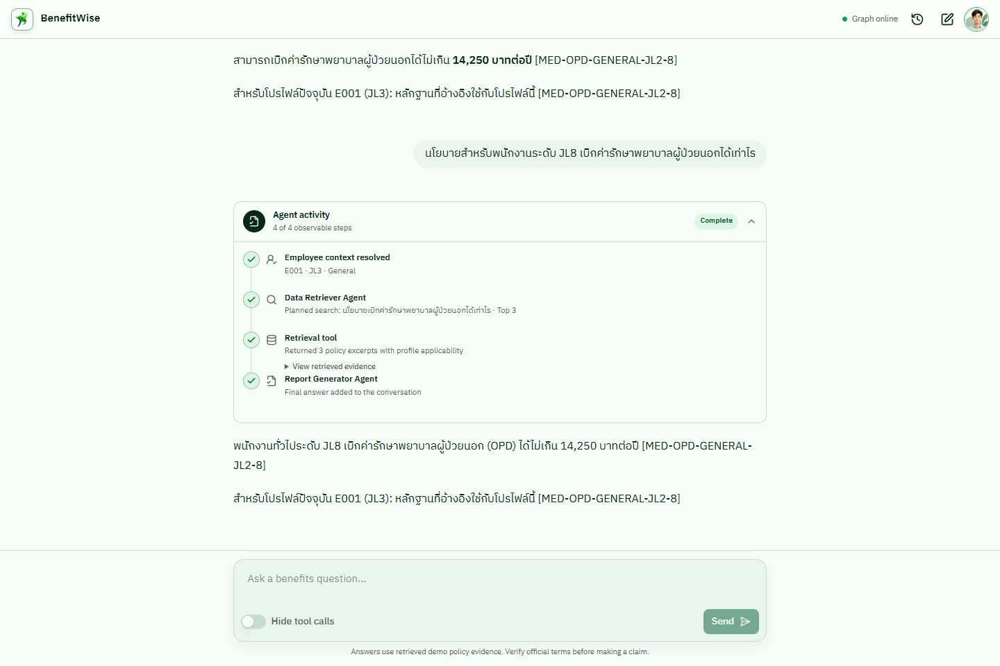

# BenefitWise AI

BenefitWise AI is a personalized employee benefits assistant for the BBL
Innovation Data and AI Fest 2026 AI Engineer programming test. The system uses
two sequential LangGraph agents: one retrieves policy evidence from a local
knowledge base, and the other turns only that evidence into a clear policy
answer followed by deterministic current-profile applicability.

> **Current status:** core RAG, both agents, the sequential LangGraph, grounded
> answer generation, CLI, retrieval/agent evaluation, labeled LangSmith traces,
> and the reviewer-facing demo UI are implemented. Final presentation cleanup
> remains future work.

## Implemented workflow



The image below is generated from the compiled application graph rather than
maintained as a separate hand-drawn workflow.


The employee identity and personal eligibility rules are deterministic. The
language model may formulate what to search for, but it may not choose or alter
the employee profile. A question that explicitly names a level such as `JL8`
retrieves the relevant policy range first; the system then states whether that
policy applies to the selected profile.

## Demo UI

The frontend keeps the standard open-source Agent Chat UI conversation layout
and real LangGraph tool-call/result rendering. It adds a fictional profile
sign-in, a compact employee avatar whose profile card opens on hover or click,
a green-and-white presentation using the supplied BenefitWise mark, and a
collapsible four-step activity log built only from observable graph state and
messages. Its Chat history page reads saved LangGraph threads, scopes them to
the selected fictional profile, and opens the original conversation. The
browser never accepts an OpenAI or LangSmith secret. This is a local
programming-test demo, not production authentication or an official employee
portal.










Start the graph and Studio in one terminal, then the Next.js UI in another:

```powershell
$env:PYTHONUTF8 = "1"
.\.venv\Scripts\langgraph.exe dev

cd frontend
npm install
npm run dev
```

Open `http://localhost:3000`. `langgraph dev` also opens LangSmith Studio,
where the same four runtime nodes visible in the compiled diagram can be
inspected. The local graph API remains at `http://127.0.0.1:2024`.

## Implemented core RAG

- Immutable employee context with employee ID, job level, country, company,
  and employee type.
- Idempotent SQLite initialization for E001/JL3 General, E002/JL6 General,
  and E003/JL1 Operations demo profiles.
- Normalized deterministic lookup with explicit unknown-employee and
  uninitialized-database errors.
- Reviewer-readable `knowledge_base.txt` containing only sanitized policy prose.
  Personal names, signatures, organization branding, extraction artifacts, and
  masked text are excluded.
- Separate `policy_metadata.json` containing the section-to-policy mapping,
  bilingual retrieval terms, and deterministic eligibility rules authored for
  this demo.
- Strict source/sidecar validation. Personal questions filter by employee
  metadata before vector ranking; explicitly named policy audiences filter by
  the policy's own level range and receive a separate applicability tag.
  Retrieval hints improve matching but never enter evidence.
- Original-question anchoring prevents an agent reformulation from broadening an
  unsupported topic into apparently relevant policy evidence.
- Persistent local Chroma vector index with OpenAI `text-embedding-3-small`
  embeddings, deterministic candidate filters, cosine similarity, a measured
  relevance threshold, and Top-K. Generated index data stays untracked.
- Natural numbered policy clauses are the retrieval chunks. Their boundaries
  already preserve complete rules, so fixed token overlap is intentionally
  `0`; retrieval metadata records that strategy explicitly.
- Employee-bound LangChain retrieval tool that exposes no employee ID argument
  to the model.
- Deterministic unit/retrieval tests plus a real embedding evaluation.
- Data Retriever Agent forced to call the custom retrieval tool exactly once.
- Tool-free Report Generator Agent with citation and numeric-grounding checks;
  a deterministic post-processing note states current-profile applicability.
- Explicit four-node LangGraph state flow and API-backed CLI demo.
- A committed deterministic agent-output evaluation and inherited LangSmith
  source/case labels for trace inspection.

After completing the environment setup in the development guide, create the
ignored local demo database with:

```powershell
python scripts/seed_employees.py
```

Run the committed 16-case personal-retrieval evaluation (requires
`OPENAI_API_KEY`):

```powershell
python scripts/evaluate_retrieval.py
```

Current results with `text-embedding-3-small`, Top-3, and a `0.26` threshold are
Hit@1 `1.000`, Hit@3 `1.000`, MRR `1.000`, and no-evidence accuracy `1.000`.
See [the evaluation report](eval/RESULTS.md) for scope and limitations.

Run the API-backed full-workflow evaluation:

```powershell
python scripts/evaluate_agents.py --limit 1
python scripts/evaluate_agents.py
```

The executed 12-case Luna baseline scored `1.000` for evidence, citations,
required facts, language, grounding, abstention, and overall accuracy. It
includes an explicit JL8 policy-scope case and the deterministic E001/JL3
applicability note. See
[the agent evaluation report](eval/AGENT_RESULTS.md); the result describes a
small curated dataset, not production accuracy.

Run one complete two-agent query:

```powershell
python scripts/run_cli.py `
  --employee-id E002 `
  --query "How much can I claim for outpatient medical expenses?" `
  --show-evidence
```

Run the committed smoke scenarios, optionally limiting API usage during
development:

```powershell
python scripts/run_smoke_queries.py --limit 1
```

Validate or inspect the graph with the LangGraph CLI:

```powershell
langgraph validate
langgraph dev
```

Regenerate the compiled graph artifact after topology changes:

```powershell
python scripts/export_graph_diagram.py
```

The verified E001/JL3 example returns the THB 14,250 annual OPD limit, while
E003/Operations JL1 returns THB 300 per visit for at most 15 visits per year.
Both answers cite their eligible policy IDs. An unsupported parking query
returns a grounded insufficient-information response without invoking the
Report Generator model.

## Project guidance

- [Architecture](docs/ARCHITECTURE.md)
- [Local development](docs/DEVELOPMENT.md)
- [Testing strategy](docs/TESTING.md)
- [Observability and trace inspection](docs/OBSERVABILITY.md)
- [Technical decisions](docs/DECISIONS.md)
- [Active plan and roadmap](PLANS.md)
- [Coding-agent instructions](AGENTS.md)

Setup commands and the current verification state are documented in
[docs/DEVELOPMENT.md](docs/DEVELOPMENT.md). Executed UI screenshots are under
[`docs/assets`](docs/assets); final presentation material remains a later slice.
