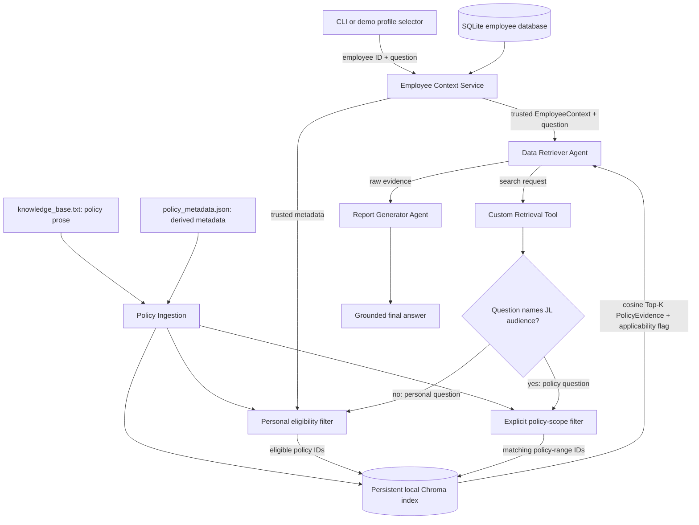

# Architecture

## Status and goal

Employee context, policy parsing/filtering, semantic retrieval, the
employee-bound tool, both agents, sequential LangGraph orchestration, local
agent evaluation, LangSmith trace labels, and the reviewer-facing demo UI are
implemented.

BenefitWise AI answers a policy question from local `knowledge_base.txt` first,
then adds a deterministic statement of how the cited policy applies to the
trusted employee profile. The two sequential LangGraph agents never decide
identity or personal eligibility.

## End-to-end design



The intended sequence is fixed:

1. Resolve the selected employee ID from SQLite.
2. Pass the resulting trusted employee context and user query into the graph.
3. Let the Data Retriever formulate a search request and call the custom tool.
4. For a personal question, resolve eligible policy IDs deterministically and
   use them as Chroma's metadata candidate filter before cosine ranking. For a
   question that explicitly names a JL audience, select policy IDs whose policy
   range includes that level; this does not replace the trusted employee ID.
5. Return Top-K raw evidence with a deterministic
   `applies_to_current_employee` flag; the retriever does not answer.
6. Give the question and evidence to the tool-free Report Generator.
7. Return a grounded policy answer followed by a deterministic current-profile
   applicability note, or an explicit insufficient-information response.

## Boundaries and responsibilities

| Component | Responsibility | Must not do |
| --- | --- | --- |
| UI / CLI | Select a demo profile and submit a question | Infer eligibility |
| Employee Context Service | Resolve employee metadata deterministically | Call an LLM |
| Policy Ingestion | Join numbered source sections with validated sidecar metadata | Put retrieval metadata into policy prose |
| Metadata Sidecar | Map sections to IDs, search terms, and eligibility rules | Act as user-visible policy evidence |
| Personal Eligibility Filter | Select personally applicable policy IDs | Use semantic similarity as an eligibility rule |
| Policy-Scope Filter | Select source policies matching an explicitly named JL range | Treat typed JL as trusted employee identity |
| Data Retriever Agent | Decide what to search for and call the retrieval tool | Produce the final user answer |
| Chroma Vector Store | Persist clause embeddings and cosine-rank only admitted policy IDs | Decide employee eligibility or become the policy source of truth |
| Retrieval Tool | Select the appropriate candidate lane, rank, and return tagged evidence | Accept LLM-authored identity as trusted input |
| Report Generator Agent | Synthesize only supplied policy evidence | Call tools, invent policy facts, or decide personal applicability |
| LangGraph | Pass explicit state through the sequential workflow | Hide identity changes in message history |

The employee context is established before agent execution. It must be injected
into retrieval from trusted graph/runtime state, not accepted as an editable
tool argument chosen by the model.

### Implemented employee-context layer

`EmployeeContext` is an immutable value with employee ID, job level, country,
company, and employee type. `SQLiteEmployeeRepository.get_by_id` normalizes
input IDs by trimming whitespace and converting them to uppercase, then performs
a parameterized lookup. Unknown IDs raise `EmployeeNotFoundError`; an absent or
uninitialized database raises `EmployeeDatabaseNotInitializedError` without
creating a database as a side effect.

The seed operation creates this local table and upserts the three fictional
profiles, making repeated initialization safe:

```text
employees(employee_id PRIMARY KEY, job_level, country, company, employee_type)
```

### Implemented policy and retrieval layer

`knowledge_base.txt` contains sanitized policy prose with natural numbered
sections and no retrieval fields or custom block markers. It is a neutral demo
adaptation of the supplied Thai source: personal names, signatures,
organization branding, internal approval data, extraction coordinates/IDs,
and masked or struck-through text are excluded.

`policy_metadata.json` is authored by the application team. It maps source
section IDs to stable policy IDs, bilingual retrieval terms, and deterministic
country/company/employee-type/job-level rules. The ingestion parser validates
both files, locates the referenced numbered sections, and builds 12 immutable
`PolicyChunk` values. Missing sections, duplicate IDs, malformed metadata, and
invalid ranges fail closed. Retrieval terms participate only in embedding;
`PolicyEvidence` contains the original section title/text and eligibility data,
never the search terms.

The source is chunked by its natural numbered clauses (for example `4.2` or
`4.4.1.1`), not by a fixed token window. The 12 current chunks are only
208-550 characters including retrieval hints and each clause preserves a
complete policy rule. Fixed overlap would therefore duplicate evidence and can
inflate near-neighbour scores without restoring missing context, so the current
strategy records `chunk_overlap=0`. If future source clauses become materially
longer, sentence/token subdivision and measured overlap should be evaluated
rather than enabled globally by assumption.

`ChromaPolicyVectorStore` stores generated embeddings locally under
`data/chroma` by default. It fingerprints the clause, eligibility metadata,
embedding model, and chunking strategy; unchanged rows reuse their stored
vectors, changed rows are upserted, and stale generated rows are removed. The
source text and sidecar remain authoritative.

`PolicyRetriever` has two deterministic candidate-selection lanes:

1. A normal personal question filters policies using trusted
   `EmployeeContext` before Chroma ranking.
2. A question that explicitly names a job level such as `JL8` selects policy
   clauses whose metadata range covers that level. This answers the policy
   question; the typed level never changes the current employee identity.
3. Synchronize changed source clauses into the persistent Chroma index.
4. Embed the search query; when an agent reformulates it, also embed the original
   user question as a deterministic relevance anchor.
5. Pass only the selected candidate IDs to Chroma as a metadata `$in` filter,
   then rank that constrained candidate set in a cosine-configured collection.
6. Convert Chroma cosine distance to similarity (`similarity = 1 - distance`).
7. Require the original-question score to meet the measured `0.26` threshold.
   Personal retrieval may rank with the better of the original and agent-query
   scores. An explicit policy-scope question ranks by the original wording, so a
   model reformulation cannot change a question about OPD into IPD.
8. Sort by the configured relevance score with policy ID as a deterministic
   tie-breaker.
9. Return up to Top-K `PolicyEvidence` objects containing raw policy text and
   a deterministic `applies_to_current_employee` flag.

The default embedding adapter lazily creates an OpenAI client for
`text-embedding-3-small`. Policy text is sent only when a generated index row is
new or changed; subsequent searches embed queries and reuse stored policy
vectors. Tests inject a deterministic embedding provider and an ephemeral
Chroma client, while runtime uses the persistent client and the committed
evaluation calls the real embedding API.

`build_policy_retrieval_tool` binds `EmployeeContext` in a closure. Its
model-visible schema contains only `query` and `top_k`. The original question
selects the candidate lane; LLM-authored tool text cannot modify profile
identity. The tool returns readable raw evidence plus current-profile
applicability as content and structured artifacts for the Data Retriever Agent.

### Implemented two-agent graph

The compiled graph has four sequential nodes:

```text
resolve_employee
  -> data_retriever_agent
  -> retrieval_tool
  -> report_generator_agent
  -> END
```

The Data Retriever Agent is bound to the employee-scoped tool with forced tool
choice. It must emit exactly one call and cannot provide a direct answer. The
tool is rebuilt from trusted state in the next node, preserving serialization
and ensuring model arguments never select identity or eligibility.

The Report Generator receives trusted employee context and structured evidence
but no tools. With no evidence, the node returns a deterministic
insufficient-information response without invoking the model. With evidence,
the model answers the directly supported policy question in the language of the
user question. Its policy IDs are internal grounding markers: deterministic
validation rejects unknown citations and numeric claims absent from trusted
context/evidence, then the application emits the IDs as structured state and
renders human-readable policy-section labels in the employee-facing answer. A
short deterministic note states whether the cited evidence applies to the
current profile. The model must not infer that a prerequisite is unnecessary
merely because an excerpt omits it; it must say that the evidence does not state
the requirement or fail closed.

CLI, smoke, and evaluation invocations attach source, workflow, fictional
employee, and optional case labels through `RunnableConfig`. LangSmith inherits
these labels across graph nodes and model/tool child runs. See
[Observability](OBSERVABILITY.md) for the trace contract and generated graph.

## Conceptual contracts

The employee, retrieval, evidence, graph input, state, and output contracts are
implemented Python APIs.

### Employee context

- `employee_id`
- `job_level`
- `country`
- `company`
- `employee_type`

### Retrieval request

- `query`: search intent formulated from the user's question
- `employee_context`: trusted injected context
- `top_k`: deterministic retrieval limit

### Policy evidence

- `policy_id`
- `title`
- `excerpt`: raw supporting policy text
- `eligibility`: policy metadata used for candidate selection and applicability
- `applies_to_current_employee`: deterministic applicability flag; never LLM-authored
- `similarity_score`

### Graph state

- `user_query`
- `employee_id`
- `messages`: optional Agent Chat UI history with the current human question,
  the Retriever Agent tool call, matching tool result, and final AI answer
- `employee_context`
- `retrieval_tool_call`
- `retrieval_query`
- `evidence`: ordered list of policy evidence
- `final_answer`
- `citation_policy_ids`: validated internal policy identifiers, returned as
  structured output rather than exposed in final-answer prose
- `grounding_valid`

The public graph accepts employee ID plus either `user_query` for CLI/evaluation
or a latest human item in `messages` for Agent Chat UI. Both interfaces execute
the same four nodes. The output contains trusted context, retrieval query,
evidence, final answer, grounding status, and chat messages when that contract
was used. The model still never receives an employee-ID tool argument.

### Demo UI boundary

The Next.js frontend stores only a fictional E001/E002/E003 profile selection
in browser local storage. It sends the selected ID as graph input, but SQLite
remains the authoritative employee-context source on every run. The UI renders
real streamed tool messages and evidence from graph state; it does not generate
tool activity or policy snippets itself. Browser environment variables contain
only the public graph URL and graph ID—never OpenAI or LangSmith keys.

The chat groups the actual message sequence into a compact, collapsible activity
log: resolved employee context, Retriever Agent tool call, matching
`ToolMessage` result, and Report Generator completion. Raw retrieved evidence
is available through a nested disclosure. The log does not request, synthesize,
or display private model reasoning; each status is derived from graph state or
a real message, and the final answer remains a normal chat message.

The `/history` route searches the local LangGraph thread store used by the
Agent Chat UI. It derives a display-only latest human question, final answer,
status, and update time from each saved thread, then filters the list by the
trusted `employee_id` retained in graph state. It never creates an answer,
retrieval event, or eligibility decision itself. The route is a local demo
convenience; it is not a production retention, access-control, or audit-log
solution.

## Failure behavior

- **Unknown employee:** stop before agent execution and return a deterministic
  employee-not-found error.
- **No personally eligible policies:** a personal question returns no evidence
  and does not rank ineligible content. An explicit policy-scope question may
  still return policy information tagged as not applying to the current profile.
- **No relevant evidence:** the Report Generator states that the available
  policy information is insufficient and does not fill gaps from general
  knowledge.
- **Embedding/model/tool failure:** surface a controlled error with enough
  context for tracing, without exposing secrets or returning a fabricated
  benefit answer.
- **Malformed policy data:** fail parsing or skip a rejected chunk explicitly;
  never silently broaden its eligibility.

## Deliberate exclusions

Production authentication, SSO, network databases, hosted vector services,
Deep Agents, and production deployment infrastructure are outside the
assignment's initial scope. The implemented profile sign-in simulates a trusted
session for the demo and is labeled accordingly throughout the UI.
