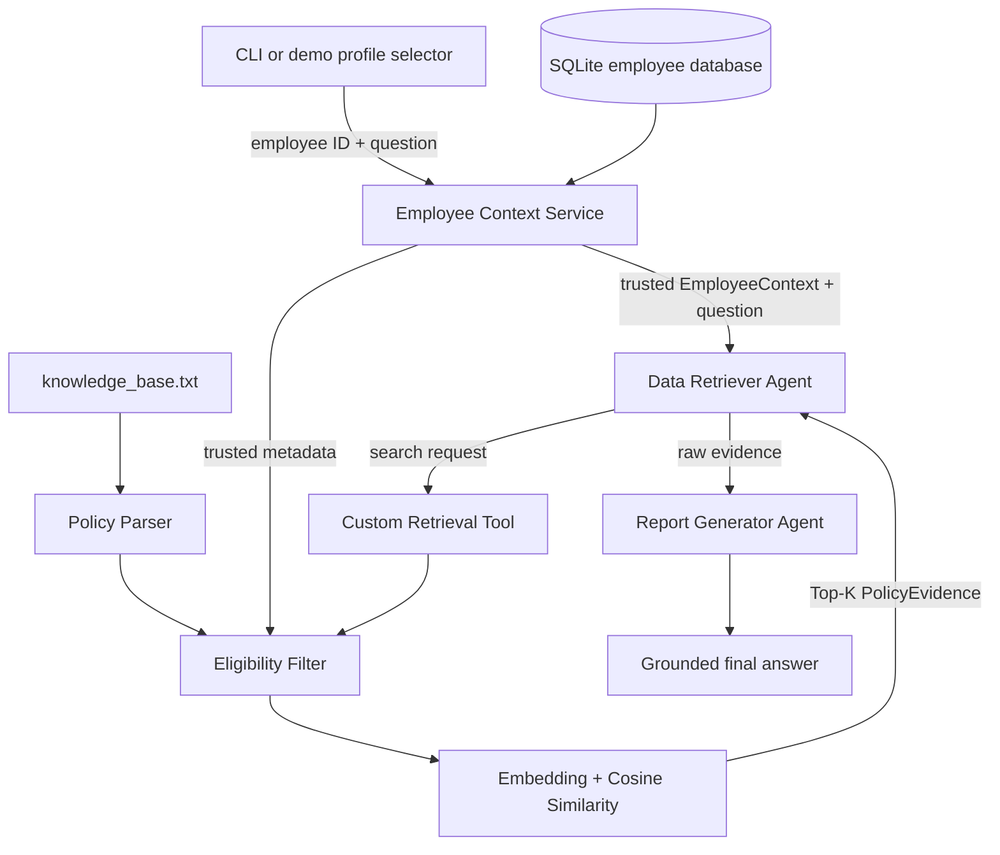

# Architecture

## Status and goal

This document distinguishes the implemented core RAG from the planned agentic
workflow. Employee context, policy parsing/filtering, semantic retrieval, and
the employee-bound LangChain tool are implemented. The agents, LangGraph graph,
answer generation, and UI remain planned.

BenefitWise AI will answer employee-benefit questions using a trusted employee
profile, eligible policy evidence from local `knowledge_base.txt`, and two
sequential LangGraph agents. The design intentionally keeps deterministic
business rules outside the language model.

## End-to-end design



The intended sequence is fixed:

1. Resolve the selected employee ID from SQLite.
2. Pass the resulting trusted employee context and user query into the graph.
3. Let the Data Retriever formulate a search request and call the custom tool.
4. Filter policy chunks against trusted metadata before similarity ranking.
5. Return Top-K raw evidence to the graph; the retriever does not answer.
6. Give the question and evidence to the tool-free Report Generator.
7. Return a grounded answer or an explicit insufficient-information response.

## Boundaries and responsibilities

| Component | Responsibility | Must not do |
| --- | --- | --- |
| UI / CLI | Select a demo profile and submit a question | Infer eligibility |
| Employee Context Service | Resolve employee metadata deterministically | Call an LLM |
| Policy Parser | Turn the text knowledge base into structured chunks | Decide user identity |
| Eligibility Filter | Apply explicit policy metadata rules | Use semantic similarity as an eligibility rule |
| Data Retriever Agent | Decide what to search for and call the retrieval tool | Produce the final user answer |
| Retrieval Tool | Filter, rank, and return evidence | Accept LLM-authored identity as trusted input |
| Report Generator Agent | Synthesize only supplied evidence | Call tools or invent policy facts |
| LangGraph | Pass explicit state through the sequential workflow | Hide identity changes in message history |

The employee context is established before agent execution. It must be injected
into retrieval from trusted graph/runtime state, not accepted as an editable
tool argument chosen by the model.

### Implemented employee-context layer

`EmployeeContext` is an immutable value with employee ID, job level, country,
company, and employee type. `SQLiteEmployeeRepository.get_by_id` normalizes
input IDs by trimming whitespace and converting them to uppercase, then performs
a parameterized lookup. Unknown IDs raise `EmployeeNotFoundError`; an absent or
uninitialized database raises `EmployeeDatabaseNotInitializedError` without
creating a database as a side effect.

The seed operation creates this local table and upserts the three fictional
profiles, making repeated initialization safe:

```text
employees(employee_id PRIMARY KEY, job_level, country, company, employee_type)
```

### Implemented policy and retrieval layer

The strict parser converts 12 blocks in `knowledge_base.txt` into immutable
`PolicyChunk` values. It rejects missing, duplicate, unknown, empty, or invalid
metadata instead of broadening eligibility. `PolicyEligibility` matches country,
company, employee type, and numeric job-level range.

`PolicyRetriever` performs this fixed sequence:

1. Validate the query and Top-K value.
2. Filter policies using trusted `EmployeeContext`.
3. Embed only the query and eligible policy text.
4. Calculate cosine similarity and apply the `0.25` relevance threshold.
5. Sort by descending score with policy ID as a deterministic tie-breaker.
6. Return up to Top-K `PolicyEvidence` objects containing raw policy text.

The default embedding adapter lazily loads
`sentence-transformers/all-MiniLM-L6-v2`. Tests inject a deterministic embedding
provider, while the committed evaluation runs the real model.

`build_policy_retrieval_tool` binds `EmployeeContext` in a closure. Its
model-visible schema contains only `query` and `top_k`. The tool returns readable
raw evidence as content and the same evidence as structured artifacts for the
future Data Retriever Agent.

## Conceptual contracts

The employee, retrieval, and evidence contracts are implemented Python APIs.
Graph state remains a planned contract for the agent branch.

### Employee context

- `employee_id`
- `job_level`
- `country`
- `company`
- `employee_type`

### Retrieval request

- `query`: search intent formulated from the user's question
- `employee_context`: trusted injected context
- `top_k`: deterministic retrieval limit

### Policy evidence

- `policy_id`
- `title`
- `excerpt`: raw supporting policy text
- `eligibility`: policy metadata used during filtering
- `similarity_score`

### Graph state

- `user_query`
- `employee_context`
- `evidence`: ordered list of policy evidence
- `final_answer`

The future implementation should use explicit typed state so each node's input
and output can be tested independently.

## Failure behavior

- **Unknown employee:** stop before agent execution and return a deterministic
  employee-not-found error.
- **No eligible policies:** return no evidence; do not rank ineligible content.
- **No relevant evidence:** the Report Generator states that the available
  policy information is insufficient and does not fill gaps from general
  knowledge.
- **Embedding/model/tool failure:** surface a controlled error with enough
  context for tracing, without exposing secrets or returning a fabricated
  benefit answer.
- **Malformed policy data:** fail parsing or skip a rejected chunk explicitly;
  never silently broaden its eligibility.

## Deliberate exclusions

Production authentication, SSO, network databases, vector databases, Deep
Agents, and production deployment infrastructure are outside the assignment's
initial scope. A profile selector simulates a trusted session for the demo.
