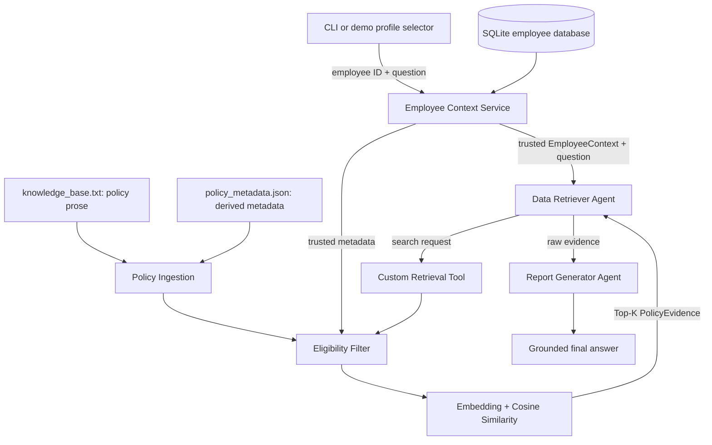

# Architecture

## Status and goal

Employee context, policy parsing/filtering, semantic retrieval, the
employee-bound tool, both agents, and sequential LangGraph orchestration are
implemented. The UI and production-oriented observability remain planned.

BenefitWise AI will answer employee-benefit questions using a trusted employee
profile, eligible policy evidence from local `knowledge_base.txt`, and two
sequential LangGraph agents. The design intentionally keeps deterministic
business rules outside the language model.

## End-to-end design



The intended sequence is fixed:

1. Resolve the selected employee ID from SQLite.
2. Pass the resulting trusted employee context and user query into the graph.
3. Let the Data Retriever formulate a search request and call the custom tool.
4. Filter policy chunks against trusted metadata before similarity ranking.
5. Return Top-K raw evidence to the graph; the retriever does not answer.
6. Give the question and evidence to the tool-free Report Generator.
7. Return a grounded answer or an explicit insufficient-information response.

## Boundaries and responsibilities

| Component | Responsibility | Must not do |
| --- | --- | --- |
| UI / CLI | Select a demo profile and submit a question | Infer eligibility |
| Employee Context Service | Resolve employee metadata deterministically | Call an LLM |
| Policy Ingestion | Join numbered source sections with validated sidecar metadata | Put retrieval metadata into policy prose |
| Metadata Sidecar | Map sections to IDs, search terms, and eligibility rules | Act as user-visible policy evidence |
| Eligibility Filter | Apply explicit policy metadata rules | Use semantic similarity as an eligibility rule |
| Data Retriever Agent | Decide what to search for and call the retrieval tool | Produce the final user answer |
| Retrieval Tool | Filter, rank, and return evidence | Accept LLM-authored identity as trusted input |
| Report Generator Agent | Synthesize only supplied evidence | Call tools or invent policy facts |
| LangGraph | Pass explicit state through the sequential workflow | Hide identity changes in message history |

The employee context is established before agent execution. It must be injected
into retrieval from trusted graph/runtime state, not accepted as an editable
tool argument chosen by the model.

### Implemented employee-context layer

`EmployeeContext` is an immutable value with employee ID, job level, country,
company, and employee type. `SQLiteEmployeeRepository.get_by_id` normalizes
input IDs by trimming whitespace and converting them to uppercase, then performs
a parameterized lookup. Unknown IDs raise `EmployeeNotFoundError`; an absent or
uninitialized database raises `EmployeeDatabaseNotInitializedError` without
creating a database as a side effect.

The seed operation creates this local table and upserts the three fictional
profiles, making repeated initialization safe:

```text
employees(employee_id PRIMARY KEY, job_level, country, company, employee_type)
```

### Implemented policy and retrieval layer

`knowledge_base.txt` contains sanitized policy prose with natural numbered
sections and no retrieval fields or custom block markers. It is a neutral demo
adaptation of the supplied Thai source: personal names, signatures,
organization branding, internal approval data, extraction coordinates/IDs,
and masked or struck-through text are excluded.

`policy_metadata.json` is authored by the application team. It maps source
section IDs to stable policy IDs, bilingual retrieval terms, and deterministic
country/company/employee-type/job-level rules. The ingestion parser validates
both files, locates the referenced numbered sections, and builds 12 immutable
`PolicyChunk` values. Missing sections, duplicate IDs, malformed metadata, and
invalid ranges fail closed. Retrieval terms participate only in embedding;
`PolicyEvidence` contains the original section title/text and eligibility data,
never the search terms.

`PolicyRetriever` performs this fixed sequence:

1. Validate the query and Top-K value.
2. Filter policies using trusted `EmployeeContext`.
3. Embed only the query and eligible policy text plus its sidecar search terms.
4. Calculate cosine similarity and apply the `0.26` relevance threshold.
5. Sort by descending score with policy ID as a deterministic tie-breaker.
6. Return up to Top-K `PolicyEvidence` objects containing raw policy text.

The default embedding adapter lazily creates an OpenAI client for
`text-embedding-3-small`. It sends the query and only the already-eligible
policy contexts as one embedding batch. Tests inject a deterministic embedding
provider, while the committed evaluation calls the real API.

`build_policy_retrieval_tool` binds `EmployeeContext` in a closure. Its
model-visible schema contains only `query` and `top_k`. The tool returns readable
raw evidence as content and the same evidence as structured artifacts for the
Data Retriever Agent.

### Implemented two-agent graph

The compiled graph has four sequential nodes:

```text
resolve_employee
  -> data_retriever_agent
  -> retrieval_tool
  -> report_generator_agent
  -> END
```

The Data Retriever Agent is bound to the employee-scoped tool with forced tool
choice. It must emit exactly one call and cannot provide a direct answer. The
tool is rebuilt from trusted state in the next node, preserving serialization
and ensuring model arguments never select identity or eligibility.

The Report Generator receives trusted employee context and structured evidence
but no tools. With no evidence, the node returns a deterministic
insufficient-information response without invoking the model. With evidence,
the model must cite policy IDs; deterministic validation rejects unknown
citations and numeric claims absent from trusted context/evidence, failing
closed instead of releasing an unsupported answer.

## Conceptual contracts

The employee, retrieval, evidence, graph input, state, and output contracts are
implemented Python APIs.

### Employee context

- `employee_id`
- `job_level`
- `country`
- `company`
- `employee_type`

### Retrieval request

- `query`: search intent formulated from the user's question
- `employee_context`: trusted injected context
- `top_k`: deterministic retrieval limit

### Policy evidence

- `policy_id`
- `title`
- `excerpt`: raw supporting policy text
- `eligibility`: policy metadata used during filtering
- `similarity_score`

### Graph state

- `user_query`
- `employee_id`
- `employee_context`
- `retrieval_tool_call`
- `retrieval_query`
- `evidence`: ordered list of policy evidence
- `final_answer`
- `grounding_valid`

The public graph input contains only employee ID and user query. The public
output contains trusted context, retrieval query, evidence, final answer, and
grounding status; the raw tool call remains internal state.

## Failure behavior

- **Unknown employee:** stop before agent execution and return a deterministic
  employee-not-found error.
- **No eligible policies:** return no evidence; do not rank ineligible content.
- **No relevant evidence:** the Report Generator states that the available
  policy information is insufficient and does not fill gaps from general
  knowledge.
- **Embedding/model/tool failure:** surface a controlled error with enough
  context for tracing, without exposing secrets or returning a fabricated
  benefit answer.
- **Malformed policy data:** fail parsing or skip a rejected chunk explicitly;
  never silently broaden its eligibility.

## Deliberate exclusions

Production authentication, SSO, network databases, vector databases, Deep
Agents, and production deployment infrastructure are outside the assignment's
initial scope. A profile selector simulates a trusted session for the demo.
