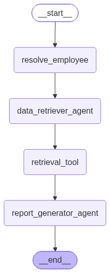

# Observability

## Trace contract

LangGraph, LangChain tool calls, and OpenAI model calls are traced by LangSmith
when `LANGSMITH_TRACING=true` and `LANGSMITH_API_KEY` are set. The application
adds a stable root run name, tags, and metadata through `RunnableConfig`; these
labels are inherited by graph nodes and their child runs.

| Invocation source | Root run name | Source tag |
| --- | --- | --- |
| CLI | `benefitwise.cli` | `source:cli` |
| Smoke runner | `benefitwise.smoke` | `source:smoke` |
| Agent evaluation | `benefitwise.evaluation` | `source:evaluation` |

Every labeled run includes the workflow name and fictional demo employee ID.
Dataset runs also include a case ID. Query text and policy evidence are not
duplicated into metadata because the normal trace already contains graph inputs
and outputs.

## Local setup and inspection

Configure the ignored `.env` file:

```dotenv
LANGSMITH_TRACING=true
LANGSMITH_API_KEY=your-key
LANGSMITH_PROJECT=bbl-agentic-rag
```

If no LangSmith key is available, leave `LANGSMITH_TRACING=false` as shown in
`.env.example`; the application and local deterministic tests still work.

Run a labeled trace with either command:

```powershell
python scripts/run_cli.py --employee-id E001 --query "What is my OPD limit?"
python scripts/evaluate_agents.py --limit 1
```

Open the configured project in LangSmith and filter by `source:evaluation`, a
`case:<case-id>` tag, or the `case_id` metadata field. The expected successful
trace hierarchy is:

```text
benefitwise.evaluation
  resolve_employee
  data_retriever_agent
    ChatOpenAI
  retrieval_tool
    retrieve_benefit_policies
  report_generator_agent
    ChatOpenAI
```

## Executed trace verification

An API-backed evaluation trace was read back from the configured
`bbl-agentic-rag` project on 2026-08-08. The root run was named
`benefitwise.evaluation`, completed successfully, carried the evaluation case
metadata, and contained the four expected graph nodes plus the nested Retriever
model, retrieval tool, and Report Generator model runs.

No LangSmith URL or account identifier is committed. Reviewers can reproduce
the trace in their own project using `.env.example`.

## Compiled graph artifact

Generate both representations from the compiled application graph:

```powershell
python scripts/export_graph_diagram.py
```

The command writes editable Mermaid source and the reviewer-facing PNG below.



## Data handling

The committed demo uses fictional employees and sanitized policy text. LangSmith
captures graph inputs and outputs, so a production version must add organization
approved masking, retention, access control, and opt-out behavior before tracing
real employee questions or identity data. API keys remain environment-only and
must never be placed in tags, metadata, screenshots, or committed artifacts.
